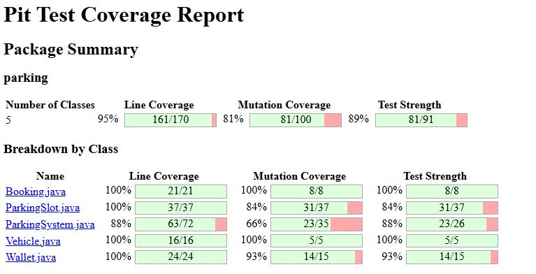

# Software Testing Report

## 0) Member

* **Student ID:** 0112310034
* **Name:** Alif Hasan Tasin

---

## A) Test Case List

# Test Case Table

| TC ID | Test Class | Test Case | Expected Result |
|---|---|---|---|
| C-001 | BookingTest | `constructorSetsAllFields()` | All booking fields are initialized with the supplied values. |
| C-002 | BookingTest | `newBookingStartsAsActive()` | A new booking has `ACTIVE` status. |
| C-003 | BookingTest | `completeBookingSetsStatusToCompleted()` | Completing a booking changes status to `COMPLETED`. |
| C-004 | BookingTest | `completeBookingDoesNotChangeOtherFields()` | Completing a booking does not change booking ID, vehicle, or amount. |
| C-005 | BookingTest | `cancelBookingSetsStatusToCancelled()` | Cancelling a booking changes status to `CANCELLED`. |
| C-006 | BookingTest | `cancelAfterCompleteOverridesStatus()` | Cancelling a completed booking changes status to `CANCELLED`. |
| C-007 | BookingTest | `completeAfterCancelOverridesStatus()` | Completing a cancelled booking changes status to `COMPLETED`. |
| C-008 | BookingTest | `toStringContainsBookingId()` | `toString()` contains the booking ID. |
| C-009 | ParkingSlotTest | `testConstructor()` | Slot fields are initialized correctly; slot is active, balance is zero, wallet exists, and bookings are empty. |
| C-010 | ParkingSlotTest | `testDeactivateSlot()` | Deactivating a slot makes it inactive. |
| C-011 | ParkingSlotTest | `testActivateSlot()` | An inactive slot can be activated. |
| C-012 | ParkingSlotTest | `testSlotIsAvailableWhenNoBookings()` | A slot with no bookings is available. |
| C-013 | ParkingSlotTest | `testSlotIsAvailableForNonOverlappingBooking()` | A new booking that starts when an existing booking ends is allowed. |
| C-014 | ParkingSlotTest | `testSlotIsUnavailableForOverlappingBooking()` | An overlapping booking is rejected as unavailable. |
| C-015 | ParkingSlotTest | `testSlotIsUnavailableWhenNewBookingStartsDuringExistingBooking()` | A booking starting during an existing booking is unavailable. |
| C-016 | ParkingSlotTest | `testSlotIsUnavailableWhenNewBookingEndsDuringExistingBooking()` | A booking ending during an existing booking is unavailable. |
| C-017 | ParkingSlotTest | `testInactiveSlotIsNotCompatible()` | An inactive slot is not compatible with a vehicle. |
| C-018 | ParkingSlotTest | `testMotorcycleCompatibleWithCompactSlot()` | Motorcycle is compatible with a compact slot. |
| C-019 | ParkingSlotTest | `testMotorcycleCompatibleWithRegularSlot()` | Motorcycle is compatible with a regular slot. |
| C-020 | ParkingSlotTest | `testMotorcycleNotCompatibleWithHandicappedSlot()` | Motorcycle is not compatible with a handicapped slot. |
| C-021 | ParkingSlotTest | `testCarCompatibleWithRegularSlot()` | Car is compatible with a regular slot. |
| C-022 | ParkingSlotTest | `testCarCompatibleWithLargeSlot()` | Car is compatible with a large slot. |
| C-023 | ParkingSlotTest | `testCarNotCompatibleWithCompactSlot()` | Car is not compatible with a compact slot. |
| C-024 | ParkingSlotTest | `testBusCompatibleWithLargeSlot()` | Bus is compatible with a large slot. |
| C-025 | ParkingSlotTest | `testBusNotCompatibleWithRegularSlot()` | Bus is not compatible with a regular slot. |
| C-026 | ParkingSlotTest | `testBicycleCompatibleWithHandicappedSlot()` | Bicycle is compatible with a handicapped slot. |
| C-027 | ParkingSlotTest | `testMicrocarCompatibleWithCompactSlot()` | Microcar is compatible with a compact slot. |
| C-028 | ParkingSlotTest | `testMicrocarNotCompatibleWithLargeSlot()` | Microcar is not compatible with a large slot. |
| C-029 | ParkingSlotTest | `testInitialBalanceIsZero()` | A new parking slot has zero balance. |
| C-030 | ParkingSlotTest | `testGetWallet()` | Slot wallet exists and has zero initial balance. |
| C-031 | ParkingSlotTest | `testGetBookings()` | Slot bookings collection exists and is initially empty. |
| C-032 | ParkingSystemTest | `testSingletonReturnsSameInstance()` | `getInstance()` returns the same `ParkingSystem` instance. |
| C-033 | ParkingSystemTest | `testInitialVehiclesListIsEmpty()` | Vehicle list is initially empty. |
| C-034 | ParkingSystemTest | `testInitialParkingSlotsListIsEmpty()` | Parking-slot list is initially empty. |
| C-035 | ParkingSystemTest | `testInitialBookingsListIsEmpty()` | Booking list is initially empty. |
| C-036 | ParkingSystemTest | `testInitialParkingRate()` | Initial parking rate is `10.0` per hour. |
| C-037 | ParkingSystemTest | `testInitialSystemBalance()` | Initial system balance is `0.0`. |
| C-038 | ParkingSystemTest | `testAddVehicle()` | A vehicle can be added and appears in the vehicle list. |
| C-039 | ParkingSystemTest | `testAddMultipleVehicles()` | Multiple vehicles can be added successfully. |
| C-040 | ParkingSystemTest | `testAddParkingSlot()` | A parking slot can be added and appears in the slot list. |
| C-041 | ParkingSystemTest | `testAddMultipleParkingSlots()` | Multiple parking slots can be added successfully. |
| C-042 | ParkingSystemTest | `testGetAvailableParkingSlotsForCar()` | For a car, compatible available regular and large slots are returned; compact is excluded. |
| C-043 | ParkingSystemTest | `testGetAvailableParkingSlotsForBus()` | For a bus, only the compatible large slot is returned. |
| C-044 | ParkingSystemTest | `testGetAvailableParkingSlotsForBicycle()` | For a bicycle, all four tested slot types are available. |
| C-045 | ParkingSystemTest | `testGetAvailableParkingSlotsExcludesInactiveSlot()` | Inactive slots are excluded from available slots. |
| C-046 | ParkingSystemTest | `testGetAvailableParkingSlotsWhenNoSlotsExist()` | An empty list is returned when no slots exist. |
| C-047 | ParkingSystemTest | `testBookingWithEndTimeBeforeStartTime()` | Booking throws `IllegalBookingTimeException`. |
| C-048 | ParkingSystemTest | `testBookingWithEqualStartAndEndTime()` | Booking throws `IllegalBookingTimeException`. |
| C-049 | ParkingSystemTest | `testBookingIncompatibleSlot()` | Booking an incompatible slot throws `IllegalArgumentException`. |
| C-050 | ParkingSystemTest | `testBookingInactiveSlot()` | Booking an inactive slot throws `IllegalArgumentException`. |
| C-051 | ParkingSystemTest | `testSuccessfulBooking()` | A valid booking is created and added to system and slot booking lists. |
| C-052 | ParkingSystemTest | `testBookingHasCorrectVehicle()` | Created booking contains the supplied vehicle. |
| C-053 | ParkingSystemTest | `testBookingHasCorrectParkingSlot()` | Created booking contains the supplied parking slot. |
| C-054 | ParkingSystemTest | `testCarRegularTwoHourBookingAmount()` | Two-hour car booking on a regular slot costs `20.0`. |
| C-055 | ParkingSystemTest | `testMotorcycleRegularBookingAmount()` | Two-hour motorcycle booking on a regular slot costs `10.0`. |
| C-056 | ParkingSystemTest | `testBicycleCompactBookingAmount()` | Two-hour bicycle booking on a compact slot costs `3.2`. |
| C-057 | ParkingSystemTest | `testBusLargeBookingAmount()` | Two-hour bus booking on a large slot costs `60.0`. |
| C-058 | ParkingSystemTest | `testSetVehicles()` | Vehicle list setter replaces the system vehicle list. |
| C-059 | ParkingSystemTest | `testSetParkingSlots()` | Parking-slot list setter replaces the system slot list. |
| C-060 | ParkingSystemTest | `testSetBookings()` | Booking list setter replaces the system booking list. |
| C-061 | ParkingSystemTest | `testSetParkingRate()` | Parking rate can be changed to the supplied value. |
| C-062 | ParkingSystemTest | `testSystemWalletExists()` | System wallet exists. |
| C-063 | ParkingSystemTest | `testSetSystemWallet()` | System wallet can be replaced with the supplied wallet. |
| C-064 | ParkingSystemTest | `testResetForTesting()` | Reset clears vehicles, slots, and bookings and restores rate and balance defaults. |
| C-065 | VehicleTest | `constructor_withWallet_setsAllFieldsCorrectly()` | Vehicle ID, type, wallet, and balance are initialized correctly. |
| C-066 | VehicleTest | `constructor_withInitialBalance_createsWallet()` | Vehicle creates a wallet with the supplied initial balance. |
| C-067 | VehicleTest | `getVehicleId_returnsCorrectId()` | Vehicle ID getter returns the correct ID. |
| C-068 | VehicleTest | `getVehicleType_returnsCorrectType()` | Vehicle type getter returns the correct type. |
| C-069 | VehicleTest | `getWallet_returnsCorrectWallet()` | Wallet getter returns the same wallet instance. |
| C-070 | VehicleTest | `getBalance_returnsWalletBalance()` | Vehicle balance matches its wallet balance. |
| C-071 | VehicleTest | `toString_containsVehicleInformation()` | `toString()` contains vehicle ID, type, and balance. |
| C-072 | WalletTest | `testDefaultConstructor()` | Default wallet balance is `0.0`. |
| C-073 | WalletTest | `testInitialBalance()` | Wallet is initialized with the supplied balance. |
| C-074 | WalletTest | `testAddFunds()` | Adding valid funds increases the wallet balance. |
| C-075 | WalletTest | `testAddZeroFunds()` | Adding zero funds throws `InvalidAmountException` and balance remains unchanged. |
| C-076 | WalletTest | `testAddNegativeFunds()` | Adding negative funds throws `InvalidAmountException` and balance remains unchanged. |
| C-077 | WalletTest | `testDeductFunds()` | Deducting valid funds decreases the wallet balance. |
| C-078 | WalletTest | `testDeductExactBalance()` | Deducting the exact balance results in zero balance. |
| C-079 | WalletTest | `testDeductInsufficientFunds()` | Deducting more than the balance throws `InsufficientFundsException` and balance remains unchanged. |
| C-080 | WalletTest | `testDeductZeroFunds()` | Deducting zero funds throws `InvalidAmountException`. |
| C-081 | WalletTest | `testDeductNegativeFunds()` | Deducting negative funds throws `InvalidAmountException`. |
| C-082 | WalletTest | `testTransferFunds()` | Valid transfer decreases source balance and increases destination balance. |
| C-083 | WalletTest | `testTransferExactBalance()` | Transferring the exact source balance leaves source at zero and adds it to destination. |
| C-084 | WalletTest | `testTransferInsufficientFunds()` | Insufficient transfer throws `InsufficientFundsException` and both balances remain unchanged. |
| C-085 | WalletTest | `testTransferZeroFunds()` | Transferring zero funds throws `InvalidAmountException`. |
| C-086 | WalletTest | `testTransferNegativeFunds()` | Transferring negative funds throws `InvalidAmountException`. |

---

# B) Defects List

### Defect ID: C-001 

          
new Booking(1, vehicle, slot, start, end, -50.0);
new Booking(1, vehicle, slot, start, end, Double.NaN);

 A negative amount means the customer is paid to park. NaN and infinity break totals, comparisons and reports, because NaN is not equal to anything, including itself. 
            

### Defect ID: C-002

endTime = LocalDateTime.of(2025, 1, 1, 8, 0);   
new Booking(1, vehicle, parkingSlot, startTime, endTime, 50.0);  

 A parking session cannot end before it starts, and a zero-length session makes no sense. This produces a negative or zero duration, which leads to wrong billing and can cause overlapping or impossible slot schedules.

### Defect ID: C-004 

booking.completeBooking();

### Defect ID: C-005 

booking.cancelBooking();  

 Both methods set the status without checking the current one. A completed booking can be cancelled, and a cancelled booking can be completed. A booking can also be completed or cancelled twice.

### Defect ID: C-012

Booking b = new Booking(1, vehicle, slot, at(10), at(12), 50.0);
 
slot.getBookings().add(b);
 
b.cancelBooking();
 
slot.isAvailable(at(10), at(12));   

The loop checks only the times of each booking. It never looks at bookingStatus.(isAvailable())

### Defect ID: C-018

slot.isAvailable(at(12), at(10));

slot.isAvailable(at(11), at(11));   

slot.isAvailable(null, null);     

slot.isAvailable(null, null);      

 startTime and endTime are never validated. (isAvailable() and isCompatible())

### Defect ID: C-010

slot.deactivate();
slot.isAvailable(at(10), at(12));   
         
The two public methods disagree. A caller that uses isAvailable() directly can book a deactivated slot                            

### Defect ID: C-09

new ParkingSlot(null, ParkingSlotType.COMPACT);
new ParkingSlot("  ", ParkingSlotType.COMPACT);
new ParkingSlot("A1", null);

slotId and slotType are not validated, and the fields are not final

### Defect ID: C-47
          
book()

 double hours = java.time.Duration.between(startTime, endTime).toHours();

happens: toHours() cuts off the remainder.

### Defect ID: C-49

Vehicle truck = new Vehicle(1, VehicleType.TRUCK, 500.0);
system.addParkingSlot(new ParkingSlot("L01", ParkingSlotType.LARGE));
system.getAvailableParkingSlots(truck, start, end);   
system.book(truck, largeSlot, start, end);            

getVehicleTypeRate() has a TRUCK rate (3.0), but ParkingSlot.isCompatible() has no TRUCK case.

### Defect ID: C-50

Booking b = system.book(car, slot, start, end);

system.cancelBooking(b);

### Defect ID: C-51

Booking b = system.book(car, slot, start, end);

system.completeBooking(b);

One booking can be refunded and also paid to the slot, so the system pays out more than it received. It is the money version of Booking bug 1. If Booking is fixed, booking.completeBooking() throws before any transfer, but ParkingSystem should not depend on that.

### Defect ID: C-61

system.setPARKING_RATE_PER_HOUR(-10.0);
system.book(car, slot, start, end);   
system.setPARKING_RATE_PER_HOUR(0);   
system.setPARKING_RATE_PER_HOUR(Double.NaN);

A negative rate gives a negative amount, which makes the "payment" move money from the system to the customer. NaN breaks every total. The original Booking also accepts negative amounts, so nothing stops it. The other setters (setVehicles(null), setBookings(null), setSYSTEM_WALLET(null)) fail later with a NullPointerException, far from the cause.

### Defect ID: C-076

   
   @Test
  
    void testInitialBalance() {
    
    Wallet wallet = new Wallet(-100.0);

    assertEquals(-100.0, wallet.getBalance());
    }

this is a real bug depends on your specification. If your requirements say initial balance must be non-negative, then this is definitely a bug.

### Defect ID: C-078

    @Test
    void deductFunds_exactAmount_shouldSucceed_bug() {
    Wallet wallet = new Wallet();
    wallet.addFunds(0.1);
    wallet.addFunds(0.2);

    
    assertDoesNotThrow(() -> wallet.deductFunds(0.3));
    assertEquals(0.0, wallet.getBalance());
   }

Description: 
Here the deduction actually works fine (since 0.30000000000000004 >= 0.3 is true), but getBalance() afterward won't be exactly 0.0 — it'll be a tiny residual like 4.44E-17. That's the kind of bug that silently corrupts balances over many transactions without ever throwing an exception.

### Defect ID: C-079

      @Test
      void deductFunds_floatingPointPrecision_bug() {
      Wallet wallet = new Wallet();
      wallet.addFunds(0.1);
      wallet.addFunds(0.2);

      System.out.println("Balance: " + wallet.getBalance());

       assertEquals(0.3, wallet.getBalance());
     } 

Description:
0.1 + 0.2 in double arithmetic equals 0.30000000000000004, not 0.3. Run this test with a plain assertEquals(0.3, wallet.getBalance()) (no delta tolerance) and it will fail — proving the bug.

                                               |                

# C) Mutant Analysis

## Overall Summary

| Metric | Result |
|---|---:|
| Number of Classes | 5 |
| Line Coverage | 95% |
| Line Coverage Details | 161/170 |
| Mutation Coverage | 81% |
| Mutation Coverage Details | 81/100 |
| Test Strength | 89% |
| Test Strength Details | 81/91 |

## Breakdown by Class

| Class Name | Line Coverage | Line Coverage Details | Mutation Coverage | Mutation Coverage Details | Test Strength | Test Strength Details |
|---|---:|---:|---:|---:|---:|---:|
| `Booking.java` | 100% | 21/21 | 100% | 8/8 | 100% | 8/8 |
| `ParkingSlot.java` | 100% | 37/37 | 84% | 31/37 | 84% | 31/37 |
| `ParkingSystem.java` | 88% | 63/72 | 66% | 23/35 | 88% | 23/26 |
| `Vehicle.java` | 100% | 16/16 | 100% | 5/5 | 100% | 5/5 |
| `Wallet.java` | 100% | 24/24 | 93% | 14/15 | 93% | 14/15 |

## Pit Test Coverage Report

# D) Contribution

My contribution was focused on unit testing. My faculty designed and i am implement test cases for the major classes of the parking management system, covering functional, exception, boundary, and negative scenarios. I also performed PIT mutation testing to evaluate test effectiveness and documented the test cases and coverage results.

